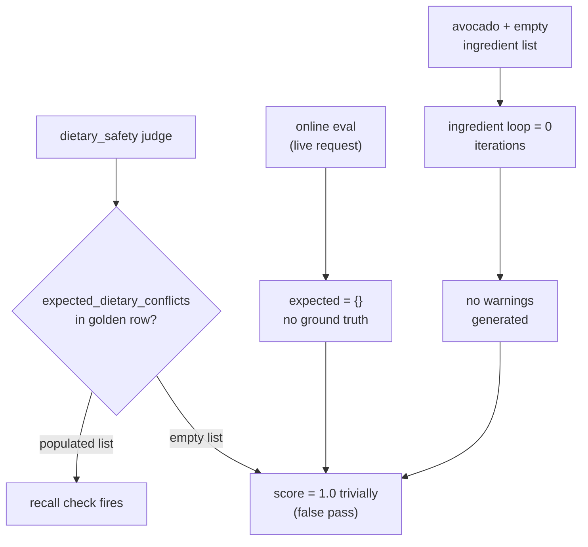
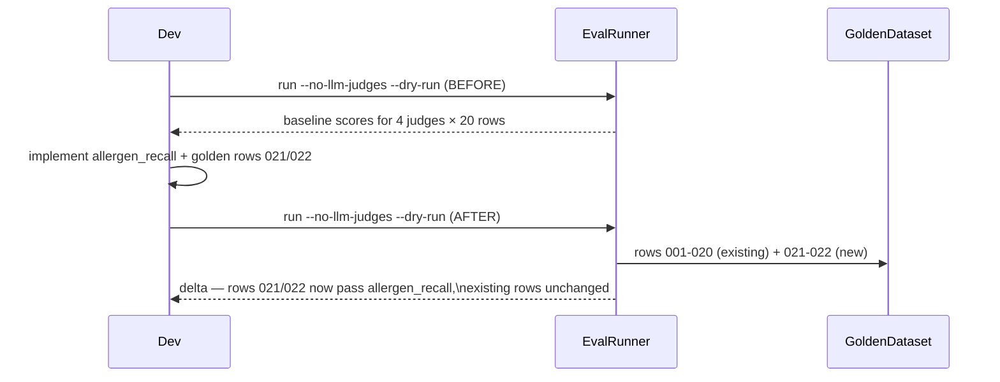

# Allergen recall evaluator

## Why the existing evals missed it




The `dietary_safety` judge requires an annotated `expected_dietary_conflicts` list to do anything. For live requests and for cases where the product page scrape yields no ingredients, it passes silently every time.

## New judge: `allergen_recall`

A **deterministic** judge that derives expected allergen warnings directly from the profile and the product facts — no ground-truth annotation required.

Logic (in [evals/judges.py](evals/judges.py)):

```python
def allergen_recall(prediction: dict, expected: dict) -> EvalResult:
    profile = expected.get("profile", {})
    user_allergens = profile.get("allergens", [])
    if not user_allergens:
        return EvalResult(score=1.0, label="pass", explanation="No allergens in profile.")

    product_facts = prediction.get("product_facts") or {}
    product_text = " ".join([
        product_facts.get("name", ""),
        product_facts.get("brand") or "",
        *product_facts.get("ingredients", []),
    ]).lower()

    # Which allergens from the profile actually appear in the product?
    expected_warnings = []
    for allergen in user_allergens:
        keywords = ALLERGEN_KEYWORDS.get(allergen.lower(), [allergen.lower()])
        if any(kw in product_text for kw in keywords) or allergen.lower() in product_text:
            expected_warnings.append(allergen)

    if not expected_warnings:
        return EvalResult(score=1.0, label="pass", explanation="No profile allergens present in product.")

    # Check which expected warnings the agent actually raised
    raised = {w.get("allergen", "").lower()
              for w in (prediction.get("personal_fit") or {}).get("allergen_warnings", [])}
    caught = sum(1 for a in expected_warnings if a.lower() in raised)
    recall = caught / len(expected_warnings)
    ...
```

Key difference from `dietary_safety`: it **derives** what should have been warned from the prediction's own `product_facts` + the profile, requiring no annotation. This means it also runs meaningfully on live requests during online eval.

## Golden dataset additions

Two new rows in [evals/golden_dataset.jsonl](evals/golden_dataset.jsonl):

- **Row 021** — Instacart or Walmart whole avocado URL, profile `allergens: ["avocado"]`, `expected_category: "LESS_OF"` or `"IN_MODERATION"`, `expected_dietary_conflicts: [{"restriction": "allergen", "ingredient": "avocado"}]`. Exercises the product-name path with an empty ingredient list.
- **Row 022** — A nut product (e.g. raw almonds) with `allergens: ["tree nuts"]`, profile no dietary restrictions. Exercises allergen detection when the product IS a tree nut.

## Register in engine

Add `allergen_recall` to `EVALUATORS` in [evals/engine.py](evals/engine.py) so it runs automatically in `/evals/v1/batch`, `run_evals.py`, and the online background task.

## Benchmark workflow




The `--dry-run` flag skips Arize logging so this is safe to run locally without sending data anywhere.

## `insufficient_data` guard

When `product_facts` is `None` or `name` is empty, the judge cannot make a meaningful determination and must not emit a false pass:

```python
if not product_facts or not product_facts.get("name"):
    return EvalResult(
        score=0.5,
        label="insufficient_data",
        explanation="product_facts missing or empty — cannot verify allergen coverage.",
    )
```

This distinguishes three outcomes: `pass` (allergens present in product and all warned), `fail` (allergen present, warning missing), `insufficient_data` (scrape returned no product data at all).

## Files to change


| File                                                     | Change                                                                                                                 |
| -------------------------------------------------------- | ---------------------------------------------------------------------------------------------------------------------- |
| [evals/judges.py](evals/judges.py)                       | Add `allergen_recall` function with `insufficient_data` guard; import `ALLERGEN_KEYWORDS` from `nutrition_agent.tools` |
| [evals/engine.py](evals/engine.py)                       | Add `"allergen_recall": allergen_recall` to `EVALUATORS`                                                               |
| [evals/golden_dataset.jsonl](evals/golden_dataset.jsonl) | Add rows 021 and 022                                                                                                   |
| [README.md](README.md)                                   | Add `allergen_recall` row to the judges table                                                                          |


